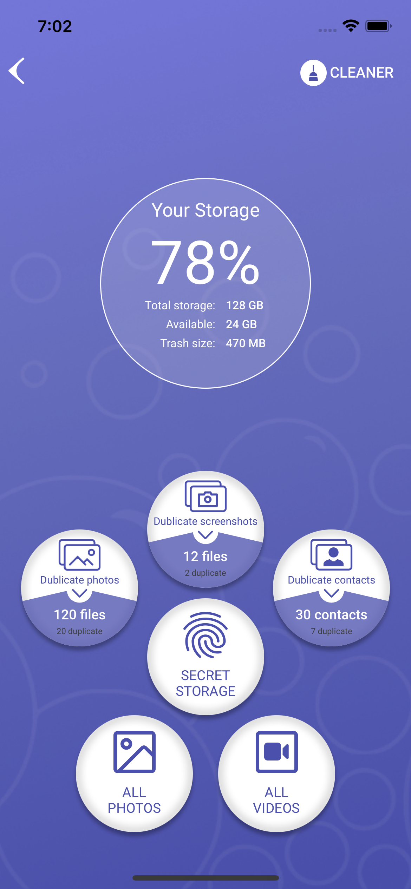
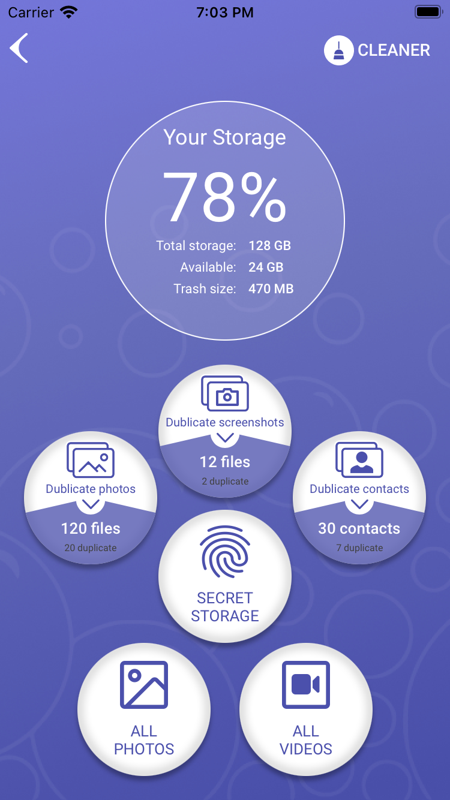

# CleanerApp

Creating an application based on a Figma template using UIKit without storyboard.
Only View, no backend.

## Features

- Programmatically created view
- The effect of pressing buttons (disabling inner and outer shadow)
- The logo is located at the top right of the navigation bar
- The standard back button has been changed to a custom button
- The background of the buttons is created programmatically using CGMutablePath

## Built With

* Swift
* UIKit

## Demo

| iPhone 12 | iPhone 8 |
| ------------- | ------------- |
|  |   |

## License

GNU General Public License v3.0
